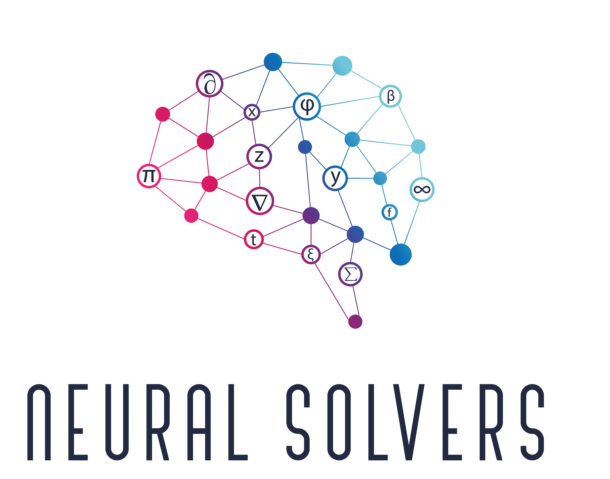
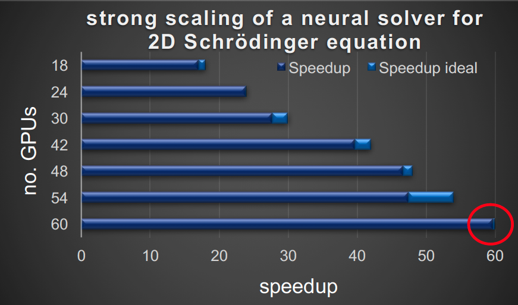

<div align="center" style="display: flex; justify-content: center; align-items: center; gap: 20px; margin-bottom: 20px;">
  
</div>


**Neural Solvers** is a framework for solving partial differential equations (PDEs) and inverse problems using physics-informed neural networks (PINNs) at scale. It leverages data parallelism to accelerate training, making it highly scalable.

## 1. Key features

- Implements physics-informed neural networks at scale
- Uses data parallelism for significant speedup in multi-GPU environments
- Supports various PDE types and boundary conditions
- Integrates with Horovod for distributed training
- Offers logging support with Wandb and TensorBoard


<figure align="center">

</figure>


## 2. Quick Start

### 2.1 Installation

```bash
git clone git@github.com:Photon-AI-Research/NeuralSolvers.git
cd NeuralSolvers
pip install .
```

### 2.2 Getting Started with 1D Burgers' Equation Example

To help you get started with Neural Solvers, we've provided an example that solves the 1D Burgers' Equation. This example demonstrates the basic usage of the library and serves as a good starting point for understanding how to set up and solve PDEs using our framework.

The `1D_Burgers_Equation.py` script in the `examples` directory provides a complete example of how to:

1. Define the problem domain
2. Set up the neural network model
3. Define initial and boundary conditions
4. Create the PINN (Physics-Informed Neural Network)
5. Train the model
6. Visualize the results

To run this example:

```bash
python examples/Burgers_Equation_1d/Burgers_Equation.py
```

We encourage you to explore this example to get a feel for how Neural Solvers works. You can use it as a template for solving your own PDEs or as a reference for understanding the library's structure.

For more advanced usage, please refer to the next sections below.

## 3. Basic Usage
Here's a simple example of how to use the PINN class:

```python
import NeuralSolvers as nsolv

# Set up your problem
pde_loss = nsolv.PDELoss(...)
initial_condition = nsolv.InitialCondition(...)
boundary_condition = nsolv.DirichletBC(...)

# Create and train the PINN
pinn = nsolv.PINN(model, input_dim, output_dim, pde_loss, initial_condition, boundary_condition)
pinn.fit(epochs=1000, learning_rate=1e-3)

# Use the trained PINN
solution = pinn(x_test)
```

In the following, we will be diving into details of each step.

### 3.1. Define datasets for co-location points

```python
import NeuralSolvers as nsolv
from torch.utils.data import Dataset

class PDEDataset(Dataset):
    def __init__(self, nf, lb, ub):
        # Initialize your PDE dataset
        pass

    def __len__(self):
        # Return length of the dataset
        pass

    def __getitem__(self, idx):
        # Return item at given index
        pass
# Similarly, define InitialConditionDataset and BoundaryConditionDataset

```    

### 3.2. Set up your problem

```python
# Create datasets
pde_dataset = PDEDataset(...)
ic_dataset = InitialConditionDataset(...)
bc_dataset = BoundaryConditionDataset(...)

# Define initial and boundary conditions
initial_condition = nsolv.InitialCondition(dataset=ic_dataset)
boundary_condition = nsolv.DirichletBC(dataset=bc_dataset)

# Define PDE residual function
def pde_residual(x, u):
    # Define your PDE here
    pass

pde_loss = nsolv.PDELoss(dataset=pde_dataset, func=pde_residual)
```

### 3.3. Create and train your model:

```python
# Define the neural network model
model = nsolv.models.MLP(input_size=2, output_size=1, hidden_size=50, num_hidden=4)

# Create PINN
pinn = nsolv.PINN(
    model, 
    input_size=2, 
    output_size=1,
    pde_loss=pde_loss, 
    initial_condition=initial_condition, 
    boundary_condition=[boundary_condition],
    use_gpu=True
)

# Train the model
pinn.fit(epochs=10000, optimizer='Adam', lr=1e-3)
```

## 4. Benchmark runner

Neural Solvers includes a benchmark runner that allows you to easily compare different PDE solvers and model architectures. This tool is particularly useful for evaluating the performance of various configurations across different types of PDEs.

### 4.1. Using the Benchmark Runner

The benchmark runner is located in the `benchmarks` directory and can be run from the command line. Here's how to use it:

```bash
python benchmarks/benchmark_runner.py --system <pde_system> --model <model_architecture> --epochs <num_epochs>

```

Where:

- `<pde_system>` can be one of: "burgers", "heat", "schrodinger", or "wave"
- `<model_architecture>` can be either "MLP" or "ModulatedMLP"
- `<num_epochs>` is the number of training epochs (default is 1000)

For example:

```bash
cd benchmarks
python benchmark_runner.py --system burgers --model MLP --epochs 1000
```

This command will train a PINN to solve the Burgers equation using an MLP architecture for 1000 epochs

### 4.2. Configuring Benchmarks

The benchmark configurations are defined in `benchmarks/configs.py`. Each PDE system has its own configuration, including:

- Domain boundaries
- PDE function and parameters
- Initial and boundary conditions
- Model architecture details

You can modify these configurations or add new ones to test different scenarios.

### 4.3. Visualizing Results
After training, the benchmark runner will automatically plot the solution predicted by the PINN. This allows for quick visual inspection of the results.

### 4.4. Extending the Benchmark Runner
The benchmark runner is designed to be extensible. You can add new PDE systems, model architectures, or evaluation metrics by modifying the appropriate files in the benchmarks directory.

This benchmarking tool provides a standardized way to compare different approaches and configurations, making it easier to evaluate and improve your PDE solving techniques using Neural Solvers.

## 5. Advanced features

### 5.1. Deep HPM support 

Instead of a PDE loss you can use a HPM model. The HPM model needs a function derivatives that calculates the needed derivatives, while the last returned derivative is the time_derivative.
You can use the HPM loss a follows. 

```python

def derivatives(x,u):
	"""
	Returns the derivatives
	
	Args: 
		x (torch.Tensor) : residual points
		u (torch.Tensor) : predictions of the pde model
	"""
	pass
	
hpm_loss = nsolv.HPMLoss(pde_dataset,derivatives,hpm_model)
#HPM has no boundary conditions in general
pinn = nsolv.PINN(model, input_size=2, output_size=2 ,pde_loss = hpm_loss, initial_condition=initial_condition, boundary_condition = [], use_gpu=True)

```


### 5.2. Horovod support
Enable distributed training with Horovod:

```python
pinn = nsolv.PINN(..., use_horovod=True)
```

Note: LBFGS optimizer is not supported with Horovod.

### 5.3. Logging
Use Wandb or TensorBoard for logging:

```python
# Wandb
logger = nsolv.WandbLogger(project_name, args)

# TensorBoard
logger = nsolv.TensorBoardLogger(log_directory)

pinn.fit(epochs=5000, logger=logger)
```

### 5.4 Adaptive Sampling

Neural Solvers now supports adaptive sampling to focus computational resources on regions of high error:

```python
sampler = nsolv.AdaptiveSampler(num_points, model, pde_function)
geometry = nsolv.NDCube(lb, ub, num_points, num_points, sampler, device=device)
```


### 5.5 Implemented Approaches:

- P. Stiller, F. Bethke, M. Böhme, R. Pausch, S. Torge, A. Debus, J. Vorberger, M.Bussmann, N. Hoffmann: 
Large-scale Neural Solvers for Partial Differential Equations (2020).


- Raissi, Maziar, Paris Perdikaris, and George Em Karniadakis.
Physics Informed Deep Learning (Part I): Data-driven Solutions of Nonlinear Partial Differential Equations.(2017).

- Raissi, Maziar, Paris Perdikaris, and George Em Karniadakis. 
Physics Informed Deep Learning (Part II): Data-driven Discovery of Nonlinear Partial Differential Equations.(2017).

- Suryanarayana Maddu, Dominik Sturm, Christian L. Müller and Ivo F. Sbalzarini (2021):
Inverse Dirichlet Weighting Enables Reliable Training of Physics Informed Neural Networks


- Sifan Wang, Yujun Teng, Paris Perdikaris (2020)
Understanding and mitigating gradient pathologies in physics-informed neural networks

- Mohammad Amin Nabian, Rini Jasmine Gladstone, Hadi Meidani (2021)
efficient training of physics-informed neural networks via importance sampling


## 6. Citation
If you use Neural Solvers in your research, please cite:

```
P. Stiller, F. Bethke, M. Böhme, R. Pausch, S. Torge, A. Debus, J. Vorberger, M.Bussmann, N. Hoffmann: 
Large-scale Neural Solvers for Partial Differential Equations (2020).
```


## 7. Develoeprs

- Nico Hoffmann (SAXONY.ai) <br/>
- Patrick Stiller (HZDR) <br/>
- Maksim Zhdanov (HZDR)<br/>
- Jeyhun Rustamov (HZDR) <br/>
- Raj Dhansukhbhai Sutariya (HZDR) <br/>
