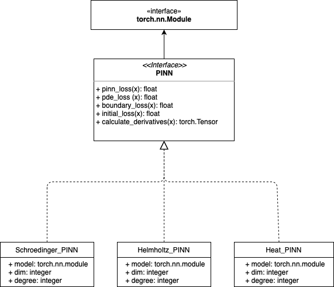

# NeuralSolvers
Neural network based solvers for partial differential equations.

##API description




## Requirements

### Libaries
```
cuda 10.2
python/3.6.5
gcc/5.5.0
openmpi/3.1.2
```

### Python requirements
```
torch==1.5.1
h5py==2.10.0
horovod==0.19.5
tensorboard==2.1.0
tensorboardX==2.0
numpy==1.19.0
Pillow==7.2.0
matplotlib==3.1.3
scipy==1.4.1
```