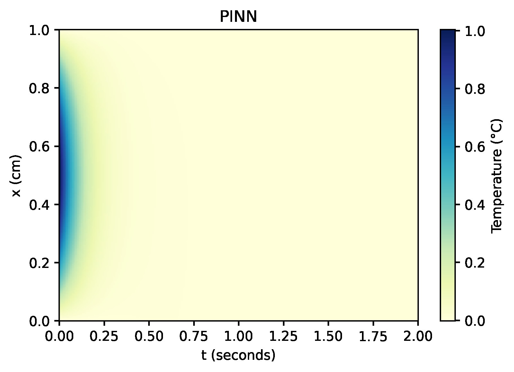
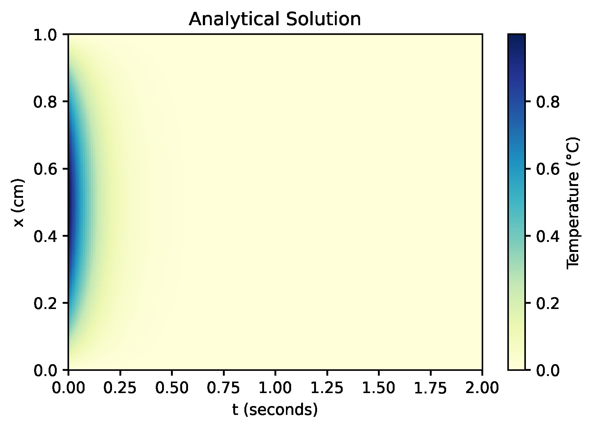
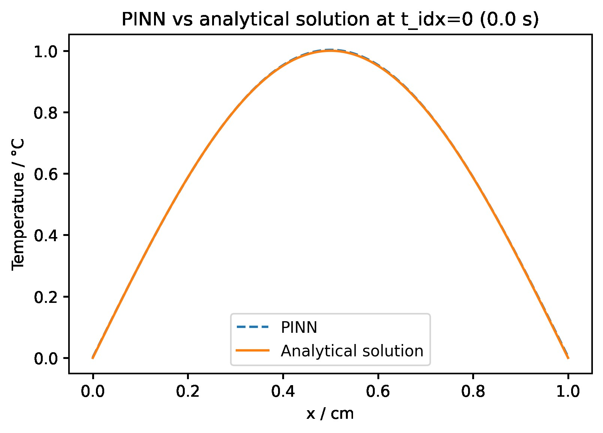
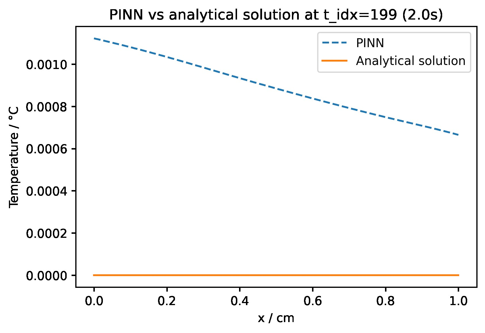
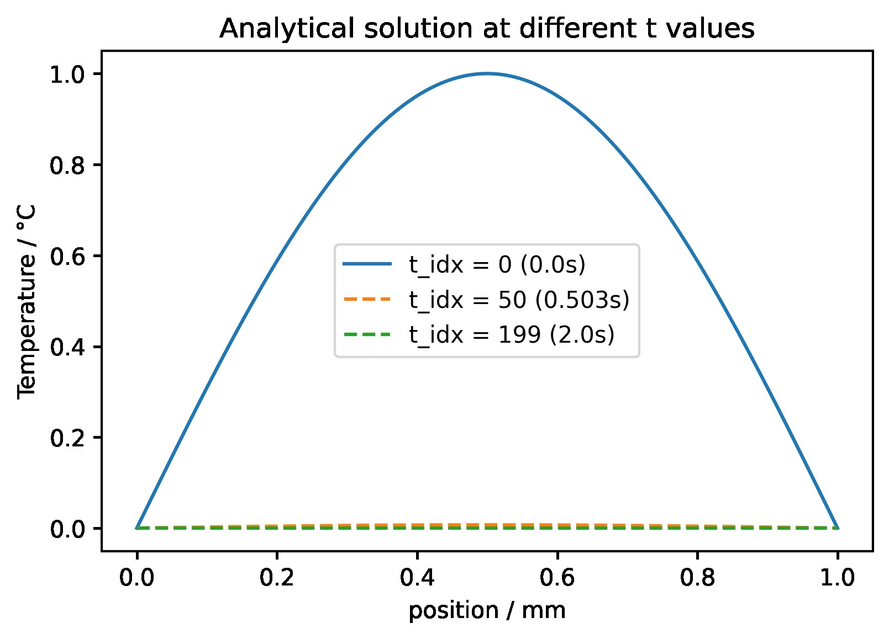

# PINN example of a 1D Heat Equation

## How to run:

python 1D_Heat_Equation.py --num_epochs=10000 --n0=50 --nb=50 --nf=20000 --num_hidden=4 --hidden_size=100

OR simply the defualt: python 1D_Heat_Equation.py 

---

Underlying PDE:
$$ u_{t}=c u_{x x}
$$
Initial condition:
$$ u(x,0)= \sin(\pi x/L)
$$
Boundary conditions:
$$ u(0,t)= 0 \\
u(L,t)= 0
$$

Analytical Solution:
$$ u(x,t)= e^{-(c\pi/L)^2t} \sin(\pi x/L)
$$

---
## Plots

   

PINN             |  Analytical solution
:-------------------------:|:-------------------------:
  |  

---
2)
<figure align="center">

</figure>

MAE: 0.001435936527217306

MSE: 3.034339863805564e-06

Relative error (%): 0.24696509076465287

---
2)
<figure align="center">

</figure>

---
3)
<figure align="center">

</figure>

MAE: 0.0011075189671584994

MSE: 1.7055700155598833e-06

Relative error (%): 26.39157042734111

---
4)
<figure align="center">

</figure>

MAE: 0.0013523007271688022

MSE: 1.8343774149890471e-06

Relative error (%): 3901.2322415257822

---

5)
<figure align="center">

</figure>

MAE: 0.0008895651348377466

MSE: 8.096860837205663e-07

Relative error (%): 47686039.576932296

---
6)
<figure align="center">

</figure>

----
7)
<figure align="center">

</figure>